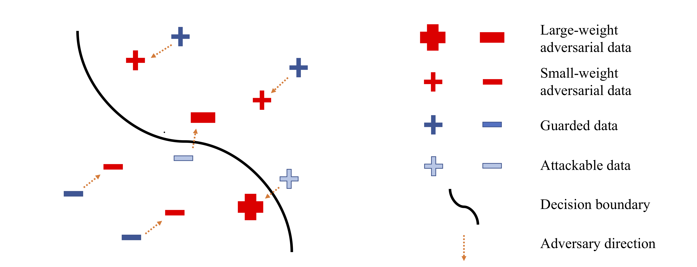

# AFP_GAIRAT: Adversarial Feature Pairing with Geometry-Aware Instance-Reweighted Adversarial Training

This repository contains the implementation and evaluation of **AFP_GAIRAT**, a novel method that integrates Adversarial Feature Pairing (AFP) with Geometry-Aware Instance-Reweighted Adversarial Training (GAIRAT) ([ICLR oral](https://openreview.net/forum?id=iAX0l6Cz8ub)) to enhance the adversarial robustness of neural networks.

---

## Overview

**AFP_GAIRAT** combines the strengths of GAIRAT and a unique approach called Adversarial Feature Pairing (AFP) to create a more robust defense against adversarial attacks:
- **GAIRAT** focuses on assigning instance-specific weights based on geometric properties.
- **AFP** ensures that the features of natural and adversarial examples remain close.

Together, these methods form AFP_GAIRAT, which achieves superior adversarial robustness.

For the implementation of GAIRAT, this repository leverages the code provided in [zjfheart/Geometry-aware-Instance-reweighted-Adversarial-Training](https://github.com/zjfheart/Geometry-aware-Instance-reweighted-Adversarial-Training).

---

## Contents

- **`Report.pdf`**: Detailed explanation of the AFP_GAIRAT method, experimental setup, and results.
- **`Code`**: Python implementation of the AFP_GAIRAT method.
- **`Experiments`**: Scripts and configurations for experiments on MNIST and CIFAR-10 datasets.
- **`Results`**: Outputs and analysis, including accuracy and adversarial robustness metrics.

---

## Method: AFP_GAIRAT

### Adversarial Training

Adversarial training uses adversarial data (instead of clean data) to update the model, enhancing its robustness against adversarial attacks.

### Adversarial Feature Pairing (AFP)

**AFP** minimizes the feature space distance between natural and adversarial examples by adding a term to the loss function. This term ensures that:
- The features of natural and adversarial examples remain paired closely, 
- Enhancing robustness to adversarial attacks.

### Geometry-Aware Instance-Reweighted Adversarial Training (GAIRAT)

**GAIRAT** assigns weights to training instances based on their distance from the decision boundary:
- **Closer instances** (to the boundary) receive higher weights, focusing the model on these critical examples.
- Distances are approximated by the number of PGD steps needed to misclassify each instance.

<p align="center">
    
</p>
<p align="left">
The illustration of GAIRAT: Instances closer to the decision boundary (lighter blue) have **larger weights** (red). Instances farther from the decision boundary (darker blue) have **smaller weights** (red).
</p>

---

## Key Components

- **Instance Reweighting**: As in GAIRAT, instances are weighted based on their geometric distance from the decision boundary.
- **Feature Pairing**: Features of natural and adversarial examples are paired to minimize their difference, enhancing robustness.

---

## Results

### MNIST Results

- **AFP_GAIRAT** demonstrates significant improvements in adversarial robustness while maintaining competitive natural accuracy.

| Defense                         | Best checkpoint |             | Last checkpoint |             |
|---------------------------------|-----------------|-------------|-----------------|-------------|
|                                 | Natural         | PGD-40      | Natural         | PGD-40      |
| Adversarial Training            | 98.06           | 92.68       | 98.06           | 92.36       |
| GAIRAT                          | 98.13           | 92.4        | 97.98           | 92.26       |
| Adversarial Feature Pairing     | 98.33           | **93.42**   | 98.33           | **93.32**   |
| GAIRAT_AFP (My Method)          | **98.37**       | 93.16       | **98.32**       | 92.62       |

### CIFAR-10 Results

- **AFP_GAIRAT** shows substantial improvement in robustness against adversarial attacks, outperforming other methods in robustness metrics.

| Defense                         | Best checkpoint |             | Last checkpoint |             |
|---------------------------------|-----------------|-------------|-----------------|-------------|
|                                 | Natural         | PGD-40      | Natural         | PGD-40      |
| Adversarial Training            | 85.76           | 53.41       | 85.63           | 51.67       |
| GAIRAT                          | 80.1            | 63.25       | 79.78           | 62.52       |
| Adversarial Feature Pairing     | **85.91**       | 53.47       | **85.68**       | 51.95       |
| GAIRAT_AFP (My Method)          | 80.78           | **64.49**   | 80.01           | **64.1**    |

---

## Prerequisites

- **Python (3.6 or higher)**  
- **PyTorch (1.2.0 or higher)**  
- **CUDA**  
- **numpy**  
- **foolbox**  

---

## How to Use

```bash
python main.py --eperminet 'AFP-GAIRAT' --dataset 'cifar10' --epoch 100 --objective 'GAIRAT_AFP'
